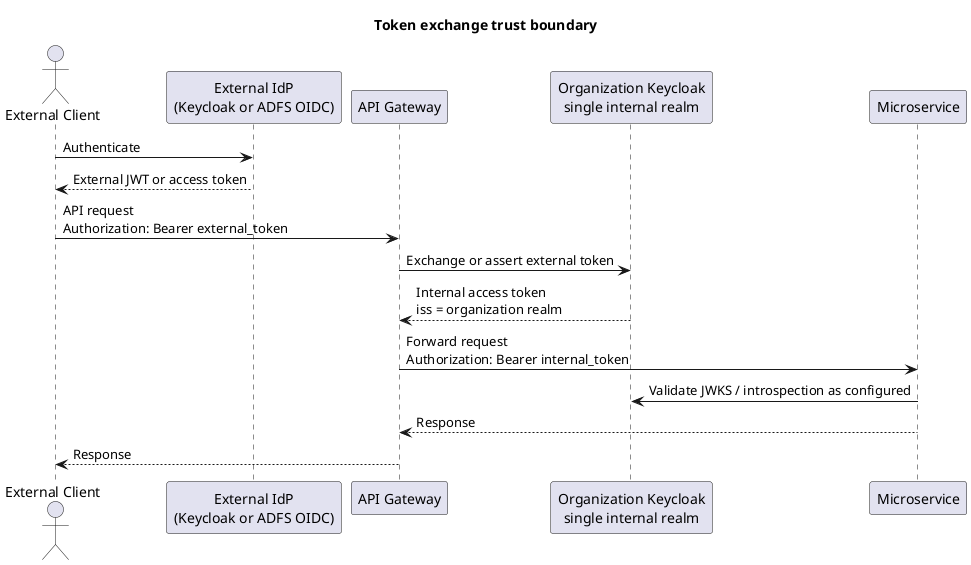
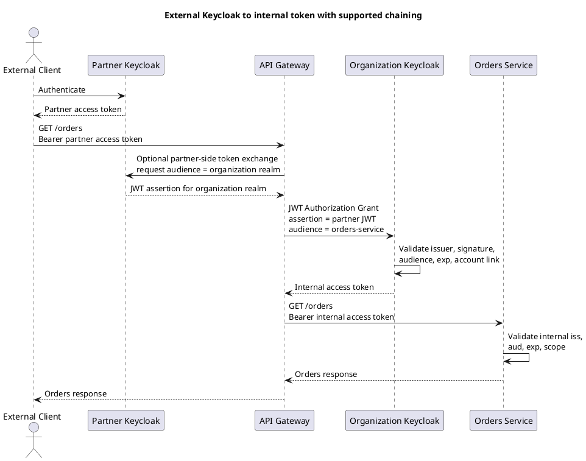
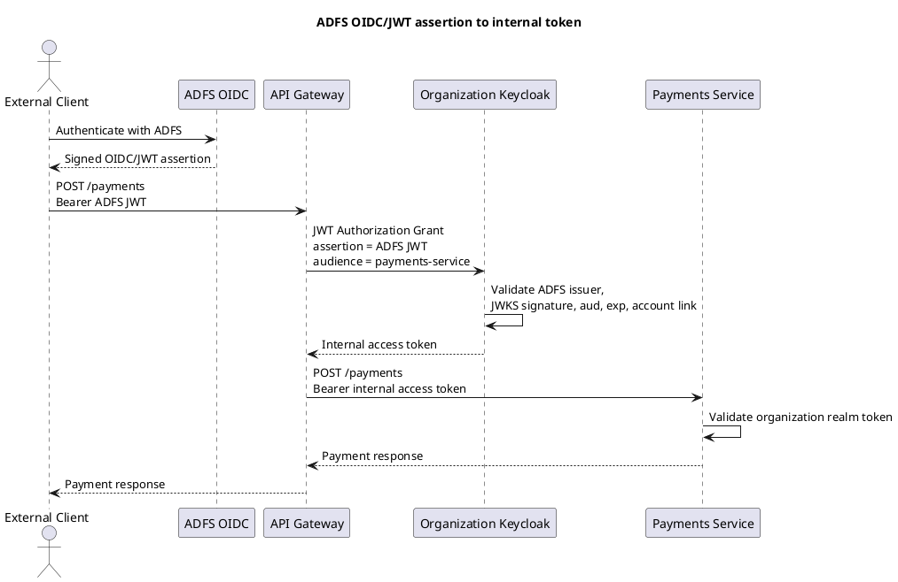
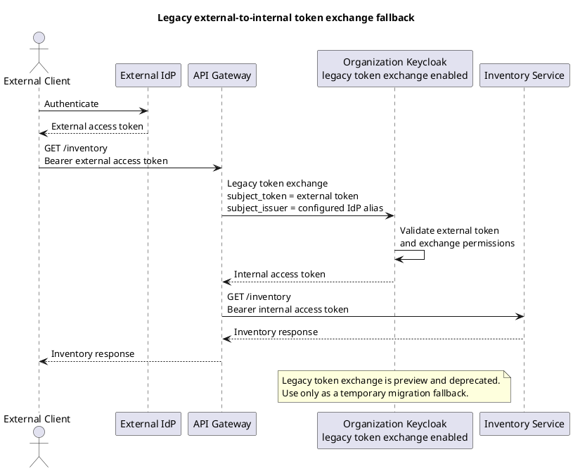
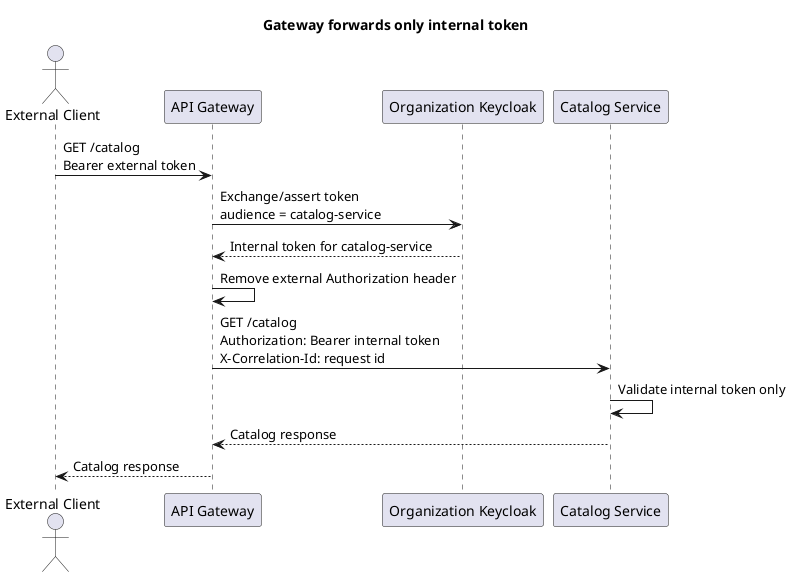
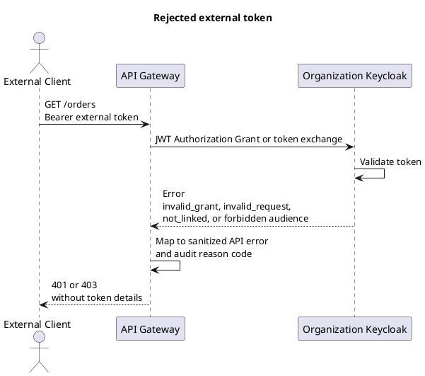
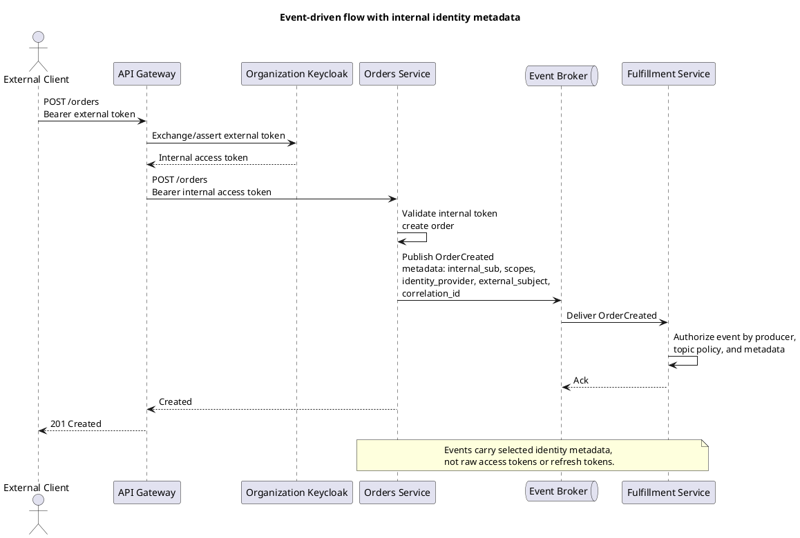

# Keycloak Token Exchange at the API Gateway

This guide describes how to use the organization Keycloak realm as the security
token service for external OAuth/OIDC tokens. The API Gateway exchanges external
tokens for internal Keycloak access tokens before forwarding requests to
microservices.

The goal is to keep external identity provider complexity at the edge. Internal
microservices trust only the organization Keycloak issuer and validate a single
internal token shape.

## References

- [RFC 8693: OAuth 2.0 Token Exchange](https://datatracker.ietf.org/doc/html/rfc8693)
- [Keycloak: Configuring and using token exchange](https://www.keycloak.org/securing-apps/token-exchange)
- [Keycloak: JWT Authorization Grant](https://www.keycloak.org/securing-apps/jwt-authorization-grant)
- [Keycloak: OAuth Identity and Authorization Chaining Across Domains](https://www.keycloak.org/securing-apps/oauth-identity-authorization-chaining-across-domains)

## Architecture

Use one internal Keycloak realm as the trust boundary.

- External organizations remain authoritative for their own users.
- The internal realm contains identity provider definitions for trusted external
  Keycloak realms and ADFS OIDC providers.
- The API Gateway is the only internal client allowed to exchange external
  tokens for internal tokens.
- Microservices validate only internal Keycloak access tokens.
- Event-producing services copy selected internal identity claims into event
  metadata and never publish raw bearer tokens.



## Realm Configuration

Use placeholders below and replace them with environment-specific values during
implementation.

| Component | Required value |
| --- | --- |
| Internal realm | `organization` |
| Token endpoint | `/realms/{realm}/protocol/openid-connect/token` |
| Gateway client | `api-gateway-token-exchanger` |
| Gateway client type | Confidential OIDC client |
| External Keycloak IdP alias | `partner-keycloak-{org}` |
| External ADFS IdP alias | `adfs-{org}` |
| Internal service audience | One client or audience per microservice or service group |

Configure the gateway client with:

- Client authentication enabled.
- Standard token exchange enabled.
- JWT Authorization Grant enabled for the allowed external identity providers.
- Only the external IdP aliases that the gateway is allowed to exchange from.
- Client scopes and audience mappers for the internal service audiences.
- Client policies that enforce downscoping and required JWT claims where
  available.

Configure every external identity provider with:

- OIDC discovery or JWKS URL.
- Exact issuer validation.
- Signature validation through JWKS or pinned public key material.
- JWT Authorization Grant enabled when the provider will supply JWT assertions.
- Account linking rules so external `iss` and `sub` resolve to the intended
  internal Keycloak user.

ADFS integrations must use OIDC/JWT tokens. SAML assertions are out of scope for
gateway token exchange.

## Supported Patterns

### Primary: Standard Token Exchange V2 plus JWT Authorization Grant

This is the preferred pattern for external Keycloak and other OIDC/JWT identity
providers.

For a partner Keycloak realm, the partner side should issue or exchange the
incoming user token into a JWT assertion whose audience is acceptable to the
organization realm. The API Gateway then sends that assertion to the
organization Keycloak realm with the JWT Authorization Grant. The internal realm
validates the JWT signature, issuer, subject, audience, expiration, and account
link, then returns an internal access token.

For ADFS, require a signed OIDC/JWT assertion. Prefer an assertion with an
audience that matches the organization Keycloak issuer or token endpoint. Use
custom audience acceptance only when ADFS cannot mint the preferred audience, and
then restrict it to the specific ADFS provider alias and gateway client.

Example JWT Authorization Grant request from the API Gateway:

```http
POST /realms/organization/protocol/openid-connect/token HTTP/1.1
Host: keycloak.internal.example
Content-Type: application/x-www-form-urlencoded
Authorization: Basic BASE64(api-gateway-token-exchanger:gateway-client-secret)

grant_type=urn:ietf:params:oauth:grant-type:jwt-bearer&
assertion=EXTERNAL_SIGNED_JWT_ASSERTION&
scope=orders.read&
audience=orders-service
```

Successful response:

```json
{
  "access_token": "INTERNAL_ACCESS_TOKEN",
  "expires_in": 300,
  "token_type": "Bearer",
  "scope": "orders.read"
}
```

### Internal Downscoping with Standard Token Exchange V2

After the gateway has an internal token, it can request a narrower token for a
specific downstream service by using RFC 8693 token exchange. Use this when a
route fans out to different service audiences and the forwarded token should
contain only the target audience and scopes.

```http
POST /realms/organization/protocol/openid-connect/token HTTP/1.1
Host: keycloak.internal.example
Content-Type: application/x-www-form-urlencoded
Authorization: Basic BASE64(api-gateway-token-exchanger:gateway-client-secret)

grant_type=urn:ietf:params:oauth:grant-type:token-exchange&
subject_token=INTERNAL_ACCESS_TOKEN&
subject_token_type=urn:ietf:params:oauth:token-type:access_token&
requested_token_type=urn:ietf:params:oauth:token-type:access_token&
audience=orders-service&
scope=orders.read
```

Keycloak Standard Token Exchange V2 supports bearer access tokens as subject
tokens. Use the `audience` parameter to downscope the resulting token to the
target service. Keycloak does not currently support the RFC 8693 `resource`
parameter in Standard Token Exchange V2.

### Temporary Fallback: Legacy External-to-Internal Token Exchange

Legacy external-to-internal token exchange may be documented and used only as a
short-term migration fallback.

Important constraints:

- It is preview and deprecated in Keycloak.
- It is disabled by default and may be removed in a future Keycloak version.
- It requires fine-grained admin permissions version 1 for exchange
  permissions.
- It must be limited to the gateway confidential client.
- It must not be the default implementation for new integrations.

Example legacy fallback request:

```http
POST /realms/organization/protocol/openid-connect/token HTTP/1.1
Host: keycloak.internal.example
Content-Type: application/x-www-form-urlencoded
Authorization: Basic BASE64(api-gateway-token-exchanger:gateway-client-secret)

grant_type=urn:ietf:params:oauth:grant-type:token-exchange&
subject_token=EXTERNAL_ACCESS_TOKEN&
subject_issuer=partner-keycloak-acme&
subject_token_type=urn:ietf:params:oauth:token-type:access_token&
requested_token_type=urn:ietf:params:oauth:token-type:access_token&
audience=orders-service
```

## Token Claims

Internal access tokens should be stable for all microservices. Prefer additive
claims so services do not need to understand each external provider.

| Claim | Purpose |
| --- | --- |
| `iss` | Internal Keycloak realm issuer only |
| `sub` | Internal Keycloak user id |
| `aud` | Target service audience or service group |
| `scope` | Internal OAuth scopes accepted by services |
| `preferred_username` | Display or audit username, not a primary key |
| `identity_provider` | External IdP alias, for example `partner-keycloak-acme` |
| `external_issuer` | Original external token issuer |
| `external_subject` | Original external subject identifier |
| `azp` | Authorized party, expected to be `api-gateway-token-exchanger` or a configured client |

Do not forward external tokens to microservices. Do not put external tokens,
refresh tokens, client secrets, or full authorization headers into logs, traces,
events, metrics, or dead-letter queues.

## Gateway Behavior

For each protected route:

1. Read the bearer token from the inbound request.
2. Determine the trusted IdP alias from route configuration, trusted issuer
   discovery, or another explicit allowlist. Do not accept arbitrary issuers.
3. Ask Keycloak to validate the external token through JWT Authorization Grant
   or the controlled legacy fallback.
4. Request only the target audience and scopes needed by the downstream service.
5. Forward the request with the internal token in the `Authorization` header.
6. Strip the original external authorization header and any inbound identity
   headers from the forwarded request.
7. Log only a token hash, Keycloak error code, IdP alias, route, correlation id,
   and sanitized reason.

The gateway may cache successful exchanges to reduce Keycloak load. Cache keys
must include a hash of the external assertion or token, the IdP alias, target
audience, requested scopes, and realm. Cache TTL must not exceed the internal
token expiration or the external assertion expiration.

## Microservice Behavior

Each microservice should:

- Trust only the internal Keycloak issuer.
- Validate the access token signature, `iss`, `aud`, `exp`, and required scopes.
- Reject tokens missing the service audience.
- Use `sub` as the stable internal user id.
- Use external provenance claims only for audit, support, and policy decisions
  that explicitly need provider context.
- Avoid external IdP SDKs or provider-specific token validation.

## Error Handling

The gateway should normalize Keycloak and IdP failures before responding to the
external client.

| Condition | Gateway response | Notes |
| --- | --- | --- |
| Missing bearer token | `401 Unauthorized` | Include `WWW-Authenticate: Bearer` |
| Invalid signature, issuer, or expiration | `401 Unauthorized` | Do not leak validation internals |
| External user not linked to internal user | `403 Forbidden` | Return a generic identity-not-linked error |
| Requested audience or scope not allowed | `403 Forbidden` | Audit the denied audience or scope |
| Keycloak unavailable | `503 Service Unavailable` | Apply retry with backoff and circuit breaker |
| Token exchange timeout | `504 Gateway Timeout` | Do not forward request without an internal token |

## Sequence Diagrams

### External Keycloak Using Supported Chaining



### ADFS OIDC/JWT Assertion



### Legacy Direct External-to-Internal Fallback



### Successful Gateway Forwarding



### Rejected Token



### Event-Driven Microservice Flow



## Acceptance Checklist

- Standard Token Exchange V2 is the primary documented Keycloak token exchange
  capability.
- JWT Authorization Grant is the primary external-to-internal pattern.
- Legacy external-to-internal exchange is marked preview, deprecated, and
  fallback-only.
- Gateway is the only client permitted to exchange external tokens.
- Microservices validate only internal organization Keycloak tokens.
- ADFS is documented only for OIDC/JWT assertions.
- SAML is out of scope for gateway token exchange.
- Every PlantUML diagram uses `@startuml` and `@enduml`.
